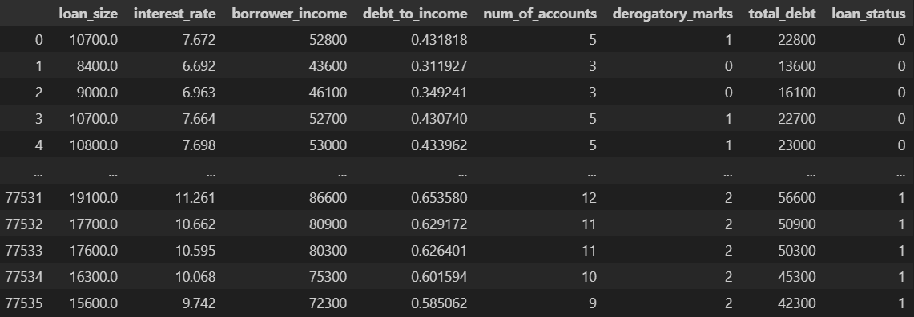

# credit-risk-classification
Module 20 Challenge for the Vanderbilt Data Analytics Bootcamp 2023

## Original Dataset


## Logistic Regression Model

### Confusion Matrix
```
array([[18694,    82],
       [   69,   539]], dtype=int64)
```

### Classification Report
We found that the logistic regression model predicts healthy loans perfectly, with an `f1-score` of 1.00. It predicts high-risk loans fairly well, with an `f1-score` of 0.88. 
```
                precision    recall  f1-score   support

  Healthy Loan       1.00      1.00      1.00     18776
High-Risk Loan       0.87      0.89      0.88       608

      accuracy                           0.99     19384
     macro avg       0.93      0.94      0.94     19384
  weighted avg       0.99      0.99      0.99     19384
```

## Logistic Regression Model Fit with Oversampled Data

### Balanced Accuracy Score
Our model had a balanced accuracy score of 0.9941807010068845. 

### Confusion Matrix
```
array([[18681,    95],
       [    4,   604]], dtype=int64)
```

### Classification Report
We found that the logistic regression model fit with oversampled data perfectly predicts healthy loans, with an `f1-score` of 1.00, and predicts high-risk loans fairly well, with an `f1-score` of 0.92. 
```
              precision    recall  f1-score   support

           0       1.00      0.99      1.00     18776
           1       0.86      0.99      0.92       608

    accuracy                           0.99     19384
   macro avg       0.93      0.99      0.96     19384
weighted avg       1.00      0.99      1.00     19384
```

# Code from Documentation
The cell 
```
# Import the RandomOverSampler module form imbalanced-learn
from imblearn.over_sampling import RandomOverSampler

# Instantiate the random oversampler model
# # Assign a random_state parameter of 1 to the model
ros_model = RandomOverSampler(random_state=1)

# Fit the original training data to the random_oversampler model
# https://imbalanced-learn.org/stable/references/generated/imblearn.over_sampling.RandomOverSampler.html
X_res, y_res = ros_model.fit_resample(X_train, y_train)
```
contains code adapted from [this page](https://imbalanced-learn.org/stable/references/generated/imblearn.over_sampling.RandomOverSampler.html). 